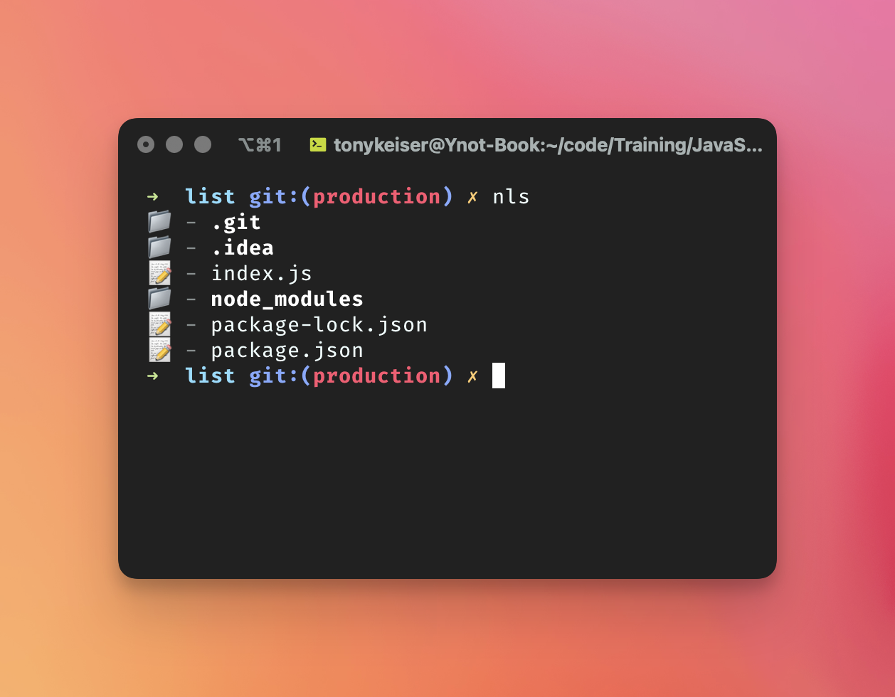

# Basically a copy of `ls` but v2.0 👍

```bash
# In a terminal window run
nls
# By default this will list out files and folders in the current directory

# To target a different directory add the path as the next argument
nls ../
# this will list files and folders of the parent directory
```

Note: this is not a published package, so you'll have to run `npm link` to get the `nls` command to work.


